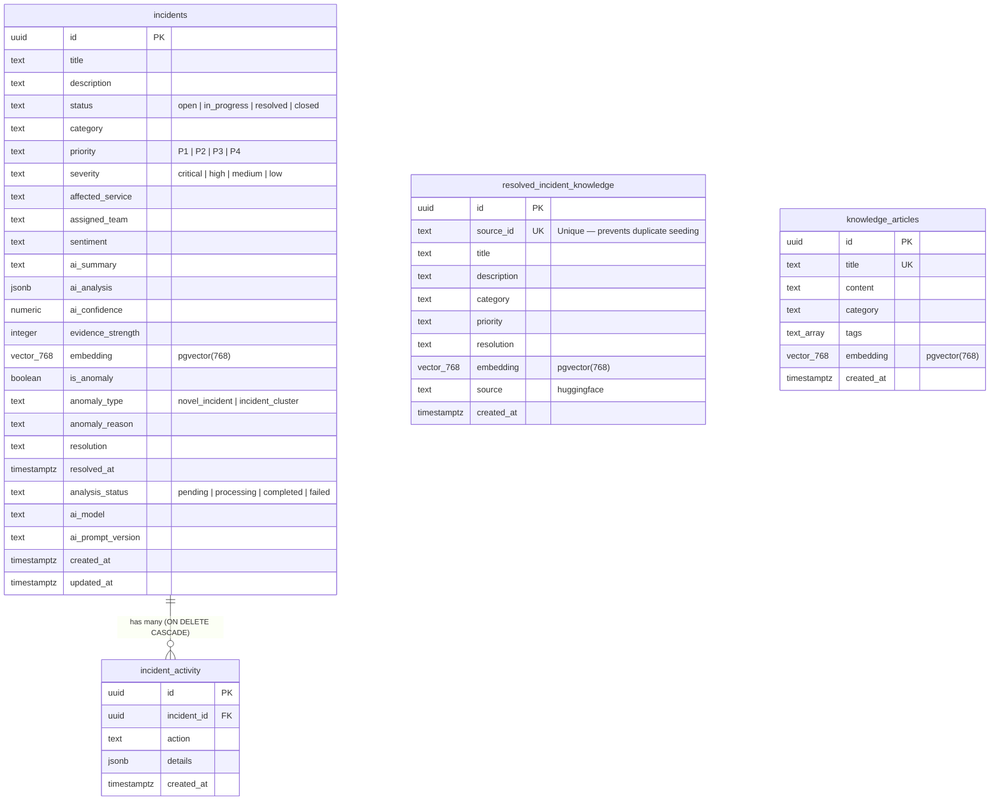

# SignalDesk — Database ER Diagram

## Entity Relationship Diagram

---

## Vector Columns

All three tables with embeddings use `vector(768)` from pgvector:

| Table | Column | Dimensions | Task Type |
|-------|---------|------------|-----------|
| `incidents` | `embedding` | 768 | RETRIEVAL_QUERY |
| `resolved_incident_knowledge` | `embedding` | 768 | RETRIEVAL_DOCUMENT |
| `knowledge_articles` | `embedding` | 768 | RETRIEVAL_DOCUMENT |

All vector indexes use **HNSW** (Hierarchical Navigable Small World) with cosine similarity (`vector_cosine_ops`) for fast approximate nearest-neighbor search.

---

## RPC Functions

| Function | Purpose |
|----------|---------|
| `match_resolved_incidents(embedding, threshold, count)` | Cosine similarity search on resolved tickets |
| `match_knowledge_articles(embedding, threshold, count)` | Cosine similarity search on KB articles |
| `detect_incident_cluster(category, service, window_minutes, threshold)` | Count recent incidents by category/service |

---

## Key Constraints

- `incidents.status` — enum check constraint
- `incidents.priority` — enum check constraint  
- `incidents.analysis_status` — enum check constraint
- `incidents.ai_confidence` — CHECK (0 ≤ value ≤ 1)
- `incidents.evidence_strength` — CHECK (0 ≤ value ≤ 100)
- `resolved_incident_knowledge.source_id` — UNIQUE (prevents duplicate seeding)
- `incident_activity.incident_id` — FK with ON DELETE CASCADE
