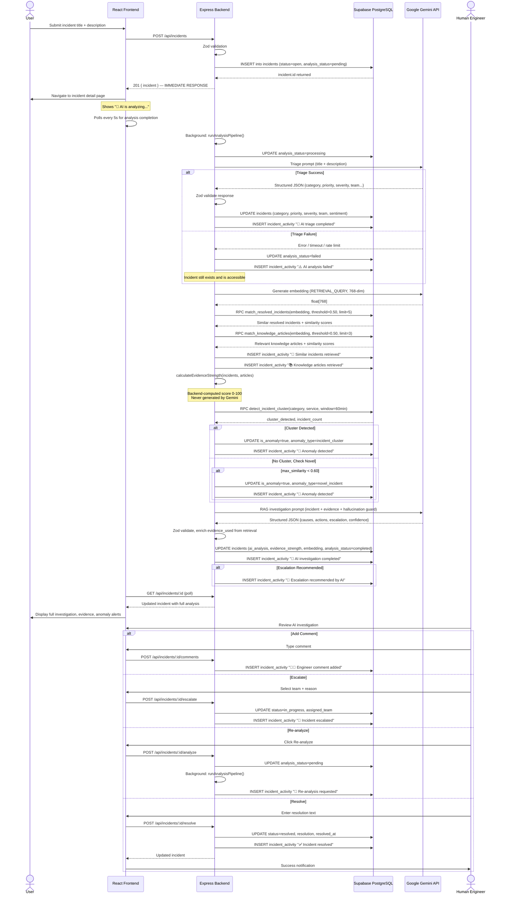
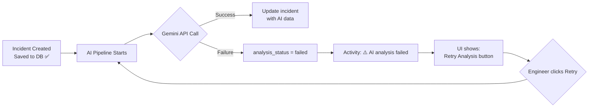

# SignalDesk — Incident Lifecycle

## Sequence Diagram

---

## Gemini Failure Path

## Persistence Guarantee

> **The incident is ALWAYS saved before any AI processing begins.**
> A Gemini failure, timeout, or rate limit will NEVER cause a ticket to be lost.
> Engineers can always retry analysis from the UI.
