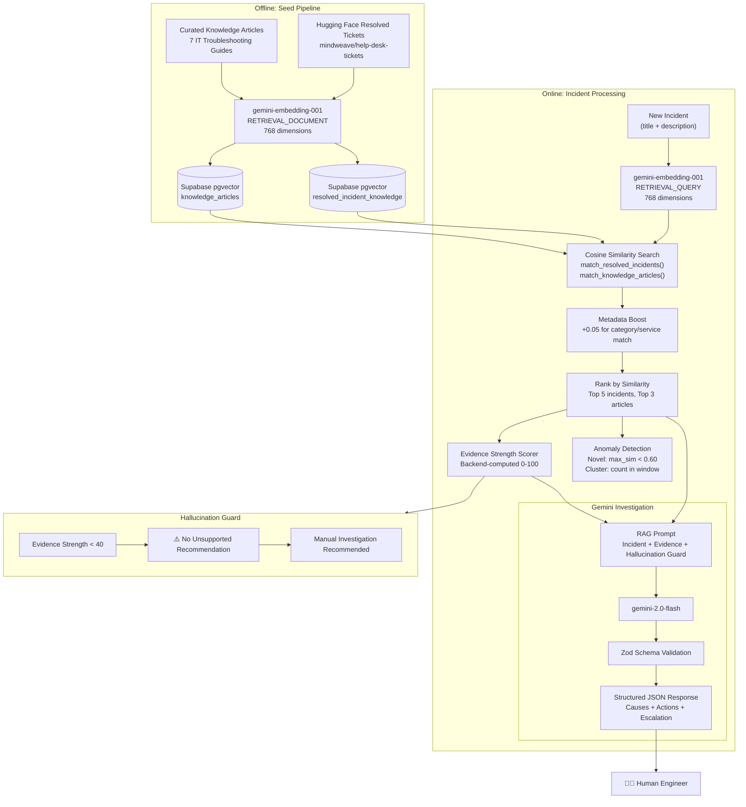

# SignalDesk — RAG Architecture

## RAG Pipeline Overview

SignalDesk uses Retrieval-Augmented Generation (RAG) to ground AI investigation in historical evidence rather than relying on Gemini's parametric knowledge alone.

---

## RAG Architecture Diagram

---

## Similarity Thresholds

| Threshold | Value | Meaning |
|-----------|-------|---------|
| Weak | < 0.50 | Below retrieval cutoff |
| Moderate | 0.50 – 0.60 | Low-quality evidence |
| Useful | 0.60 – 0.75 | Acceptable evidence |
| Good | 0.75 – 0.85 | Good evidence |
| Strong | > 0.85 | Strong evidence |

## Evidence Score Factors

| Factor | Max Points | Description |
|--------|------------|-------------|
| Max similarity | 40 | Top retrieved item similarity × 40 |
| Useful resolved incidents | 30 | Count with similarity ≥ 0.75, capped at 2 |
| Relevant KB articles | 20 | Count with similarity ≥ 0.60, capped at 2 |
| Strong evidence bonus | 10 | Items with similarity ≥ 0.85 |

## Task Types

- **Seed time**: `RETRIEVAL_DOCUMENT` — optimizes embeddings for storage/retrieval
- **Query time**: `RETRIEVAL_QUERY` — optimizes embeddings for searching

## Hallucination Guard

The system explicitly prevents AI from generating unsupported resolutions:

1. Evidence strength is computed **entirely in TypeScript** from retrieval scores
2. When score < 40 (low), the investigation prompt includes explicit instructions to **not invent solutions**
3. The UI displays a **⚠️ LOW EVIDENCE WARNING** to the engineer
4. Gemini is instructed to recommend **human investigation** instead of speculating
5. The recommended_actions list will contain: "Escalate to human engineer for investigation"
