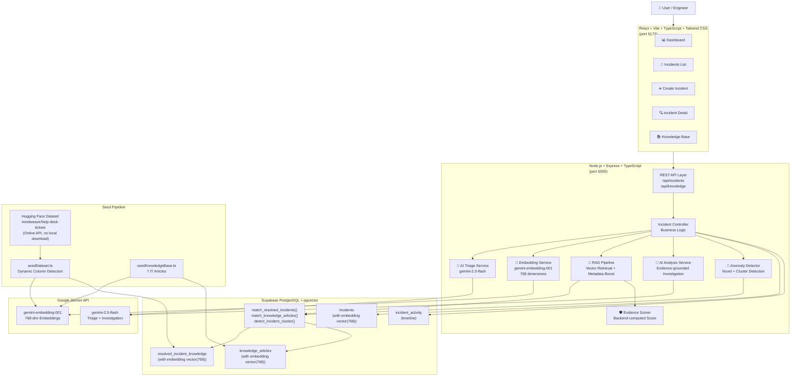

# SignalDesk — System Architecture

## Overview

SignalDesk is a full-stack AI-powered incident intelligence platform. It uses Gemini AI for triage and RAG-grounded investigation, Supabase pgvector for semantic retrieval, and an evidence-scoring system to prevent AI hallucinations.

---

## System Architecture Diagram

---

## Key Design Decisions

### 1. Persistence-First Flow
Incidents are saved to Supabase **before** any AI processing. If Gemini fails, the ticket is never lost. AI runs in the background after the HTTP response returns.

### 2. Backend-Only AI
All Gemini API calls happen server-side. The `GEMINI_API_KEY` and `SUPABASE_SECRET_KEY` are never exposed to the browser.

### 3. Backend-Computed Evidence Score
The evidence strength score (0–100) is computed from retrieval quality metrics in TypeScript code — not generated by Gemini. This prevents AI from inflating its own confidence.

### 4. Hallucination Guard
When evidence strength is below threshold, the system explicitly tells users evidence is insufficient rather than generating an unsupported recommendation.

### 5. Explainable Anomaly Detection
Both anomaly types (novel incident, incident cluster) are detected by backend logic — similarity thresholds and time-window database queries — not by Gemini judgment.
